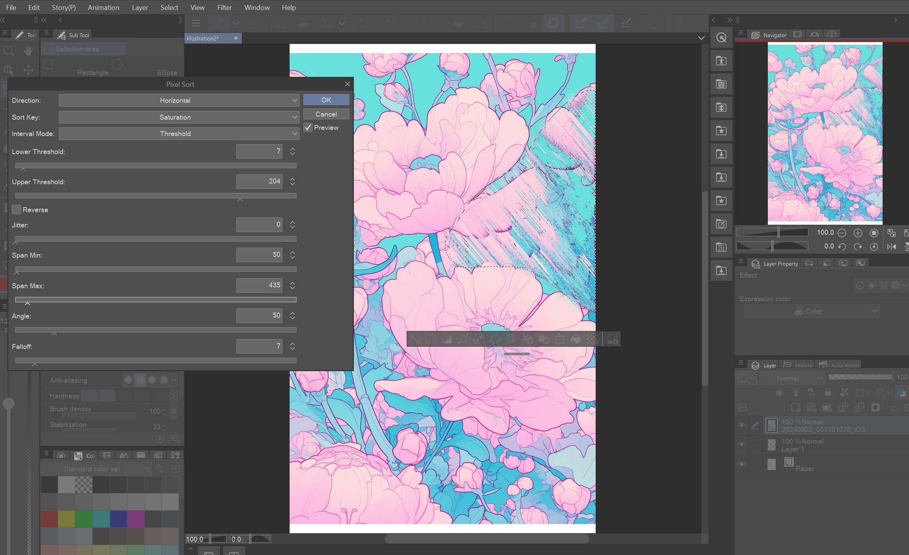

# Pixel Sort Plugin for Clip Studio Paint

A filter plugin for Clip Studio Paint that applies pixel sorting effects to your artwork. Pixel sorting rearranges pixels along rows or columns based on color properties, creating glitch-art style streaks and gradients.



## Features

- **Sort Keys**: Brightness, Hue, Saturation, Intensity, Minimum, Red, Green, Blue
- **Interval Modes**: Threshold, Random, Edges, Waves, None
- **Angle**: Sort along any angle (0-359 degrees)
- **Falloff**: Randomly skip spans for organic variation (0-100%)
- **Thresholds**: Upper and lower bounds for span detection
- **Reverse**: Reverse the sort order
- **Jitter**: Randomize sorted pixel positions
- **Span Min/Max**: Control minimum and maximum span lengths
- **Selection Support**: Works with CSP's built-in selection tools, including partial selection blending

## Building

### Requirements

- Visual Studio 2022 Community (or higher) with C++ desktop development workload
- v143 platform toolset

### Build Steps

1. Open a terminal in the project root
2. Run `build.bat`, or manually:

```
"C:\Program Files\Microsoft Visual Studio\2022\Community\MSBuild\Current\Bin\MSBuild.exe" PixelSort\PixelSortPlugin\ProjectWin\PixelSort.sln /p:Configuration=Release /p:Platform=x64
```

3. The built DLL will be at: `PixelSort\PixelSortPlugin\OutputWin\PixelSort\PixelSort\Release\x64\PixelSort.dll`

## Deployment

1. Close Clip Studio Paint
2. Copy `PixelSort.dll` to your CSP plugin directory:
   ```
   C:\Program Files\CELSYS\CLIP STUDIO 1.5\CLIP STUDIO PAINT\PlugIn\PAINT\
   ```
   This requires administrator privileges. You can run `deploy.bat` as administrator, or copy manually.
3. Launch Clip Studio Paint
4. The filter appears under **Filter > Distortion > Pixel Sort**

## Usage

1. Open an image or create artwork on a raster layer (RGB)
2. Optionally make a selection to limit the effect area
3. Go to **Filter > Distortion > Pixel Sort**
4. Adjust parameters in the filter dialog - preview updates in real-time
5. Click OK to apply

### Parameter Guide

| Parameter | Range | Description |
|-----------|-------|-------------|
| Direction | Horizontal / Vertical | Axis along which pixels are sorted |
| Sort Key | 8 options | Which color property to sort by |
| Interval Mode | 5 modes | How sorting spans are detected |
| Lower Threshold | 0-255 | Lower bound for threshold span detection |
| Upper Threshold | 0-255 | Upper bound for threshold span detection |
| Reverse | On/Off | Reverse the sort order |
| Jitter | 0-100 | Random displacement of sorted pixels |
| Span Min | 1-10000 | Minimum span length (shorter spans are discarded) |
| Span Max | 0-10000 | Maximum span length (0 = unlimited) |
| Angle | 0-359 | Sorting angle in degrees (horizontal direction only) |
| Falloff | 0-100 | Percent chance to skip sorting each span |

## SDK

This plugin is built using the Triglav Plugin SDK from CELSYS. The SDK headers are included in `PixelSort/TriglavPlugInSDK/`.

---

Disclaimer

This software is provided "as is", without warranty of any kind, express or implied, including but not limited to the
warranties of merchantability, fitness for a particular purpose, and noninfringement. In no event shall the author be
liable for any claim, damages, or other liability, whether in an action of contract, tort, or otherwise, arising from,
out of, or in connection with the software or the use or other dealings in the software.

Use at your own risk. This plugin is not affiliated with or endorsed by CELSYS, Inc.

## License

MIT
